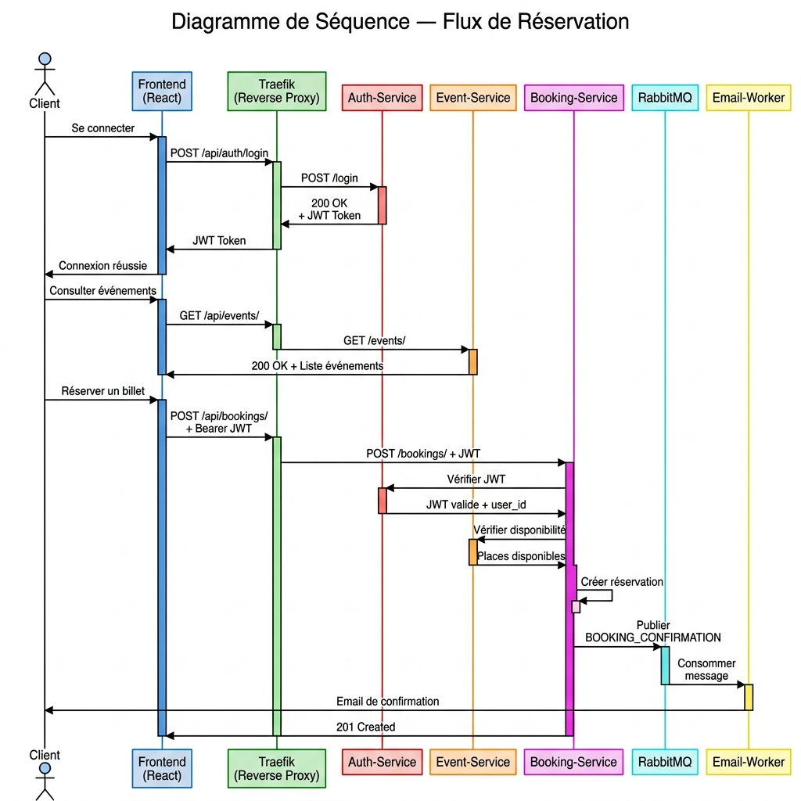
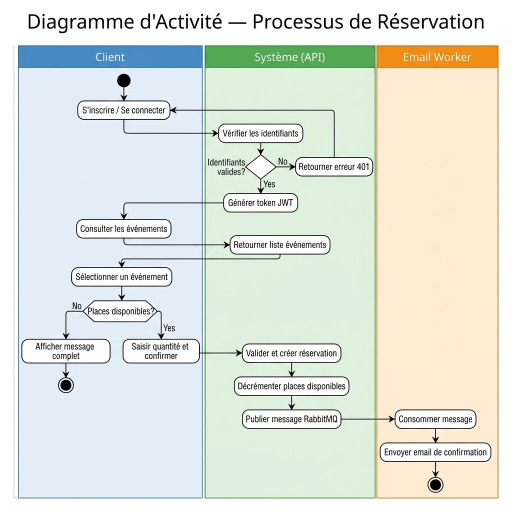
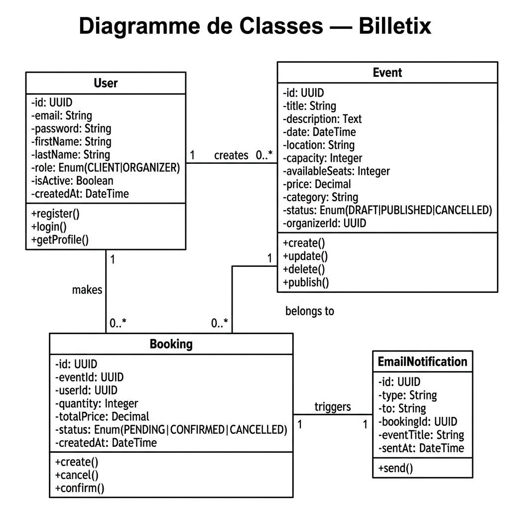

\newpage

# Introduction

## Contexte du Projet

**Billetix** est une plateforme de gestion et de réservation d'événements développée dans le cadre du cours d'Architecture Orientée Services (SOA). L'objectif est de concevoir une application distribuée reposant sur des microservices indépendants communicants de manière synchrone (REST) et asynchrone (RabbitMQ).

## Objectifs Techniques

| Contrainte | Technologie | Statut |
|---|---|---|
| API REST CRUD | Django REST Framework | Implémenté |
| Authentification JWT | Python / bcrypt | Implémenté |
| Service Registry / Discovery | HashiCorp Consul | Implémenté |
| Reverse Proxy / Load Balancing | Traefik v2 | Implémenté |
| Communication Asynchrone | RabbitMQ | Implémenté |
| Déploiement Multi-Conteneurs | Docker Compose | Implémenté |
| Interface Utilisateur | React + TypeScript | Implémenté |

\newpage

# Architecture du Système

## Vue d'Ensemble

L'architecture de Billetix est composée de **8 services Docker** interconnectés au sein d'un réseau bridge `billetix-network`.

- **Traefik** (port 8090/8080) : point d'entrée unique (Gateway), reverse proxy dynamique.
- **Auth-Service** (port interne 8000) : authentification et gestion centralisée des tokens JWT.
- **Event-Service** (port interne 8001) : gestion du catalogue d'événements et des stocks de places.
- **Booking-Service** (port interne 8002) : orchestration des réservations et communication asynchrone.
- **Email-Worker** : consommateur RabbitMQ dédié au traitement des notifications.
- **Frontend** : application React/TypeScript (Vite) avec un design premium.
- **Consul** (port 8500) : annuaire de services (Service Discovery).
- **RabbitMQ** (ports 5673/15674) : bus d'événements asynchrone (AMQP).

## Diagramme de Séquence — Flux de Réservation

Le diagramme ci-dessous illustre les interactions entre les différents microservices lors d'un scénario complet de réservation.



**Scénario :**

1. L'utilisateur s'inscrit/se connecte : **Auth-Service** retourne un JWT
2. Il consulte les événements : **Event-Service** retourne la liste
3. Il réserve un billet : **Booking-Service** crée la réservation
4. Booking-Service publie dans RabbitMQ (queue `email.send`)
5. **Email-Worker** consomme le message et envoie la confirmation

\newpage

## Diagramme d'Activité — Processus de Réservation

Ce diagramme présente le flux d'activités côté client, système API et worker email, avec les décisions et les bifurcations possibles.



\newpage

# Description des Microservices

## Auth Service

**Port interne :** 8000 | **Route Traefik :** `/api/auth`

### Endpoints

| Méthode | Endpoint | Description | Auth |
|---------|----------|-------------|------|
| POST | `/api/auth/register/` | Inscription | Non |
| POST | `/api/auth/login/` | Connexion JWT | Non |
| POST | `/api/auth/refresh/` | Renouvellement token | Non |
| GET | `/api/auth/me/` | Profil utilisateur | Oui |
| GET | `/api/auth/health/` | Health check | Non |

### Modèle Utilisateur

| Champ | Type | Description |
|-------|------|-------------|
| id | UUID | Identifiant unique |
| email | String | Email (unique) |
| password | String | Hash bcrypt |
| first_name | String | Prénom |
| last_name | String | Nom |
| role | Enum | CLIENT ou ORGANIZER |
| is_active | Boolean | Compte actif |
| created_at | DateTime | Date de création |

### Sécurité

- **Hachage :** bcrypt avec salage automatique
- **Anti-brute force :** blocage après 5 tentatives échouées (300 secondes)
- **Tokens :** Access token (courte durée) + Refresh token (longue durée)

---

## Event Service

**Port interne :** 8001 | **Route Traefik :** `/api/events`

### Endpoints

| Méthode | Endpoint | Description | Rôle requis |
|---------|----------|-------------|-------------|
| GET | `/api/events/` | Lister les événements | Public |
| POST | `/api/events/` | Créer un événement | ORGANIZER |
| GET | `/api/events/{id}/` | Détail d'un événement | Public |
| PUT | `/api/events/{id}/` | Modifier un événement | ORGANIZER |
| DELETE | `/api/events/{id}/` | Supprimer | ORGANIZER |

### Modèle Événement

| Champ | Type | Description |
|-------|------|-------------|
| id | UUID | Identifiant unique |
| title | String | Titre (max 200 car.) |
| description | Text | Description |
| date | DateTime | Date de l'événement |
| location | String | Lieu |
| capacity | Integer | Capacité totale |
| available_seats | Integer | Places disponibles |
| price | Decimal | Prix par billet |
| category | String | Catégorie |
| status | Enum | DRAFT, PUBLISHED, CANCELLED |
| organizer_id | UUID | Référence organisateur |

---

## Booking Service

**Port interne :** 8002 | **Route Traefik :** `/api/bookings`

### Endpoints

| Méthode | Endpoint | Description | Auth |
|---------|----------|-------------|------|
| POST | `/api/bookings/` | Créer une réservation | Oui |
| GET | `/api/bookings/me/` | Mes réservations | Oui |
| GET | `/api/bookings/health/` | Health check | Non |

### Modèle Réservation

| Champ | Type | Description |
|-------|------|-------------|
| id | UUID | Identifiant unique |
| event_id | UUID | Référence à l'événement |
| user_id | UUID | Référence à l'utilisateur |
| quantity | Integer | Nombre de billets |
| total_price | Decimal | Prix total calculé |
| status | Enum | PENDING, CONFIRMED, CANCELLED |
| created_at | DateTime | Date de création |

### Message RabbitMQ publié après réservation

```json
{
  "type": "BOOKING_CONFIRMATION",
  "to": "client@example.com",
  "booking_id": "uuid...",
  "event_title": "Festival Tech Alger 2025"
}
```

---

## Gateway & Routage (Traefik)

| Préfixe URL | Service cible | Test de santé (Health) |
|-------------|---------------|------------------------|
| `/api/auth` | auth-service | `/api/auth/health/` |
| `/api/events` | event-service | `/api/events/health/` |
| `/api/bookings` | booking-service | `/api/bookings/health/` |
| `/` | frontend | `http://localhost:5173/` |

\newpage

# Modélisation UML

## Diagramme de Classes

Le diagramme de classes ci-dessous représente les entités principales du système Billetix, leurs attributs, leurs méthodes et leurs associations.



---

## Frontend & Design Premium

Application React + TypeScript servie via Vite.

| Route | Description |
|-------|-------------|
| / | Landing page avec Hero dynamique et liste des événements |
| /login | Interface d'authentification unifiée (Login/Register) |
| /events/:id | Détails de l'événement et interface de réservation |
| /mes-reservations | Dashboard personnel (CLIENT) |

### Identité Visuelle : "Cosmic Premium"

L'interface a été conçue pour offrir une expérience immersive dépassant le cadre d'un simple MVP :

- **Thème** : Dark-first avec des accents Indigo et Violet.
- **Glassmorphism** : Utilisation de `backdrop-filter: blur(20px)` pour un effet de profondeur.
- **Gradients** : Grilles de dégradés dynamiques (Mesh Background).
- **Animations** : Transitions fluides gérées par **Framer Motion**.

\newpage

# Validation Fonctionnelle via l'Interface Web

Cette section décrit comment valider l'intégration des microservices directement depuis la plateforme Billetix.

## Scénario 1 : Cycle de Réservation (Client)
L'interface permet de tester la communication entre l'**Event-Service**, le **Booking-Service** et **RabbitMQ**.

1. **Découverte** : Sur la page d'accueil, l'utilisateur parcourt les événements récupérés dynamiquement depuis l'Event-Service.
2. **Détails & Disponibilité** : En cliquant sur un événement, le système affiche les places disponibles.
3. **Réservation** : L'utilisateur clique sur "Réserver". Le Booking-Service :
   * Valide le stock de places.
   * Décrémente les places dans l'Event-Service.
   * Publie un message dans RabbitMQ pour l'Email-Worker.
4. **Dashboard personnel** : L'utilisateur retrouve son billet avec le statut "CONFIRMED" dans son espace personnel.

## Scénario 2 : Gestion Organisateur (RBAC)
Le système applique les contraintes de sécurité (JWT + Rôles) directement dans l'UI.

1. **Accès Restreint** : Si un utilisateur "CLIENT" tente d'accéder au formulaire de création, le système redirige vers une page d'accès refusé (Validation 403).
2. **Publication** : Un "ORGANISATEUR" dispose d'un bouton "CRÉER" lui permettant d'ajouter un nouvel événement via un formulaire glassmorphic.

## Scénario 3 : Résilience et Asynchronisme
1. L'utilisateur effectue une réservation.
2. Même si l'envoi d'email prend du temps ou si le worker est redémarré, la réservation est confirmée instantanément pour l'utilisateur. 
3. Le message reste stocké en sécurité dans **RabbitMQ** jusqu'à son traitement.

\newpage

# Guide de Tests Postman & Validation

## Configuration de l'Environnement

Dans Postman, utilisez les variables pour automatiser vos tests : `BASE_URL` (`http://localhost:8090/api`) et `ACCESS_TOKEN`.

---

## Tests — Auth Service (Sécurité & JWT)

### Étape 1 : Register (`POST /api/auth/register/`)
**Body (JSON)**:
```json
{
  "email": "organisateur@billetix.dz",
  "password": "password123",
  "firstName": "Mehdi",
  "lastName": "Khedim",
  "role": "ORGANIZER"
}
```

### Étape 2 : Login (`POST /api/auth/login/`)
 **Action** : Copiez la valeur de `access` et collez-la dans l'onglet **Authorization > Bearer Token** des requêtes suivantes.

---

## Tests — Event Service (Rôles & RBAC)

### Étape 3 : Créer un Événement (Succès Organisateur)
**Body (JSON)**:
```json
{
  "title": "Cosmic Tech Night",
  "description": "Une immersion dans le futur de la tech.",
  "date": "2026-06-15T21:00:00Z",
  "location": "Alger, Cyber Parc",
  "capacity": 300,
  "price": "3500.00",
  "category": "Technologie"
}
```

### Étape 4 : Test Forbidden (Refus Client)
Tentez la même requête avec un compte `CLIENT`.
 **Attendu** : `403 Forbidden`. Prouve le respect du **RBAC**.

---

## Tests — Booking Service (RabbitMQ & Async)

### Étape 5 : Créer une Réservation (`POST /api/bookings/`)
**Body (JSON)**:
```json
{
  "eventId": "UUID_DE_L_EVENEMENT",
  "quantity": 1
}
```
 **Attendu** : `201 Created`. Montrez les logs (`docker logs -f email-worker`) pour valider RabbitMQ.

\newpage

# Conclusion

Le projet Billetix implémente une architecture microservices complète, scalable et sécurisée, alliant la robustesse de Django, l'agilité de RabbitMQ et une interface React "Premium".

**Points forts :**
- Isolation via Traefik.
- Sécurité JWT et RBAC.
- Expérience utilisateur immersive.
- Déploiement Docker fluide.
